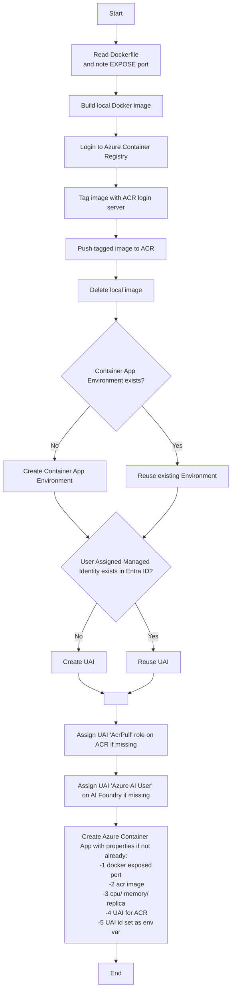

## Create conda env
```
cd agents-webapp-ui (if not already in this folder)
conda env create -f conda.yml
conda activate sk_ui_env
```

## Remove conda env
```
conda deactivate
conda env remove -n sk_ui_env -y
```

## Confirm that the code can be run fine in local docker
Build the docker instance
```
cd agents-webapp-ui (if not already in this folder)
./dockers/start.sh
```

Test the api exposed in docker container
```
cd agents-webapp-ui (if not already in this folder)
./tests/test_docker_api.sh
```

Stop the docker instance
```
cd agents-webapp-ui (if not already in this folder)
./dockers/stop.sh
```

## Deplpy the conatiner app
Pre-requisite
- Get local docker app running first for a test
- Have resources pre-created: 1) ACR, 2) AI Foundry
- Remember to feed in the variables defined in `containerapp_deploy.sh`
- Run the script to perform container app deploy action

```
cd agents-webapp-ui (if not already in this folder)
az upgrade
./containerapp/containerapp_deploy.sh
```

High level flow for container app deploy:


